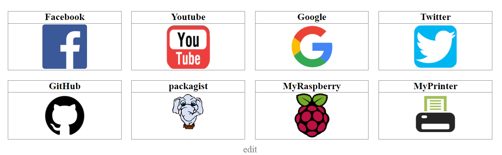
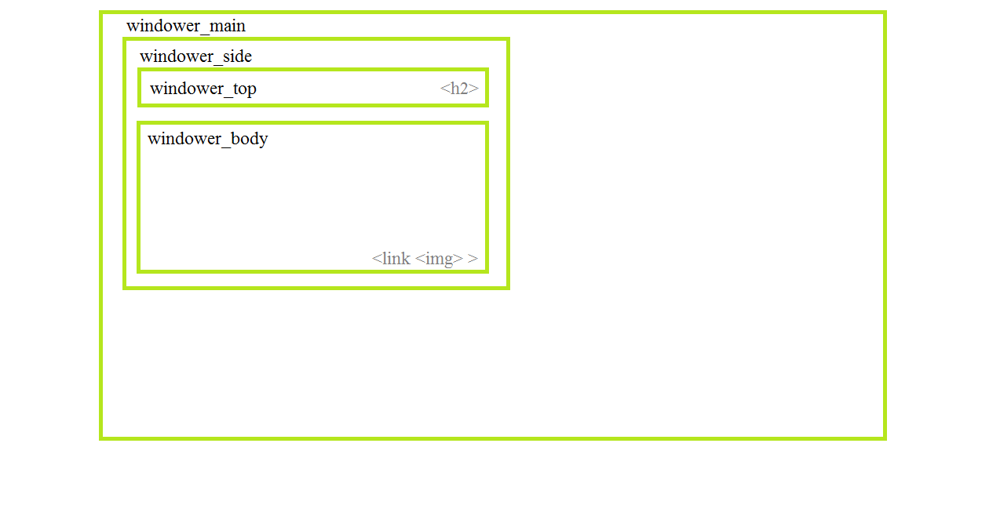

# Simple Windower - BETA

If you need a simple editable mosaic which seems like Google Chrome home page, this package is right for you.  
You can create many independent mosaics with different css sheets. Data can be stored in database or file. 



See [more](exampleImages) preview images

## Features

* Easy to use
* Editable CSS
* Database or file to store records
* Possibility to pagination of windows
* Possibility to multiple independent windows
* Window consist of title, image and link

## Install

1. Download manually Windower package. Store Windower folder exactly in your root directory.
2. OPTIONAL - You can store `edit.php` and `windower_style.css` files wherever you want.
3. Configure `config.php` file inside Windower directory. See "Configure" section for more information.
4. In `edit.php`, set `$windowerUrl` to full URL address directed to `.../Windower/` directory and `require_once` to full PATH directed to `...\\Windower\\config.php` file (`.../Windower/config.php` on Linux).
5. Configure database using PDO, if you want to use it and if it was not configured yet.
6. Insert link to style sheets everywhere you wish to show Windower windows.
7. Create objects, as many as you wish, and make sure you set IDs correctly.
8. Call public methods on your objects, to generate HTML code. Make sure you use ECHO on it.

## Configure

### Database
If you did not use PDO before, here is a example:

```php
$db_config = [
    'type'     => 'mysql',
    'name'     => 'windower_db',
    'server'   => 'localhost',
    'username' => 'root',
    'password' => 'root',
    'charset'  => 'utf8'
];
 
$db = new PDO(
    "{$db_config['type']}:host={$db_config['server']};
    dbname={$db_config['name']};charset={$db_config['charset']}",
    $db_config['username'], $db_config['password']
);
```
You need just to change parameters in `$db_config[]`.

### Links a Paths

Make sure to configure this right.

Here is one example of it:

```php
$windower_links = [
    "baseUrl"  => "http://localhost/MyPage/",
    "filePath" => "C:\\dir\\www\\MyPage\\",
    "editUrl"  => "http://localhost/MyPage/pages/edit.php",
    "imgsUrl"  => "http://localhost/MyPage/images/",
    "sheetUrl" => "http://localhost/MyPage/css/windower_style.css"
];
```
### Creating of instances

Parameter  |Explaining
----|----
id | Windower ID, must be unique number from 0 to any number
templateId | template ID, number from 1 to any umber
limit | limit of shown windows. Can be NULL or value from 1 to any number
database | PDO or NULL if database is not needed
fileName | NULL or name of file where will be stored content about windows. Example: `array.txt`
$windower_links | array with configured links and paths
reverse | can be true or false. False is set as default

Example:
```php
//file
$myWindower = new Windower(0, 1, NULL, NULL, "array.txt", $windower_links);
$windower_array[0] = &$myWindower;
 
//database 
$anotheWindower = new Windower(1, 1, NULL, $db, NULL, $windower_links);
$windower_array[1] = &$anotheWindower;
```

## Usage

After creating a new instances in config.php file, everything should pre prepared for working with windows.
Everything you need is to call methods on your objects.

Example of very simple `index.php` file:
```php
<?php	require_once 'Windower/config.php'; ?>
 
<!DOCTYPE html>
<html>
<head>
    <title>myTitle</title>
    <?= $myWindower->makeSheetsLink(); ?>
</head>
<body>
    <h1>HOME</h1>
    <?php
        echo $myWindower->makeWindow();
        echo $myWindower->makeEditButton();
	?>
	<?= $myAnotherWindower->makeWindow(); ?>
	<?= $myAnotherWindower->makeEditButton(); ?>
</body>
</html>
```

Here are methods you can call:

### `makeWindow()`
Generate HTML code for displaying windows
#### Parameters
Offset or first visible window. Can be integer or NULL. 
#### Return
```html
<div class="windower_side">
    <div class="windower_side_top">
        <h2>Google</h2>
    </div>
    <div class="windower_side_body">
        <a href=" https://www.google.sk " class="windower_side_link">
            
        </a>
    </div>
</div>
```

### `makeSheetsLink()`
Generate HTML code for header link including style sheets
#### Return
```html
<link rel="stylesheet" type="text/css" href="http://localhost/myPage/windower_style.css">
```

### `makeEditButton()`
Generate HTML code for edit button
#### Return
```html
<a href="http://localhost/myPage/dir/edit.php?id=0" class="windower_edit_button_1">edit</a>
```

### `makeEditWindow()`
Generate HTML code for displaying windows in edit mode
#### Parameters
path to Windower folder
#### Return
```html
<div class="windower_side">
    <div class="windower_side_top">
        <h2>Google</h2>
    </div>
    <div class="windower_side_body">
        <a href=" http://localhost/myPage/dir/edit.php?id=0&mv=1 " class="windower_side_edit_link">
            
        </a>
        <a href=" http://localhost/myPage/dir/edit.php?id=0&rm=1 " class="windower_side_edit_link">
            
        </a>
    </div>
</div>
```

### `makeEditForm()`
Generate HTML code for FORM
#### Parameters
Integer or NULL. ID od item to edit
 
Array or NULL. Array with editing item
#### Return
```html
<form action='' method="post">
    <input type="text" name="title" placeholder="Youtube" value="">
    <input type="text" name="link" placeholder="https://www.youtube.com/" value="">
    <input type="text" name="img" placeholder="youtube.png" value="">
    <input type="text" name="order" value="9">
    <input type="submit" name="submit" value="submit">
</form>
```

## Templates

You can use one of two predefined templates or you can create a new one.

### Creating own templates

You can choose from:
- change predefined template
- use a commented code below predefined templates
- copy-paste predefined template, but make sure to change ID everywhere it is needed

Example of template:
```
/*
    TEMPLATE_1
				*/
.windower_main_1 {
    width: 70%;
    height: auto;
    margin-right: 15%;
    margin-left: 15%;
}

.windower_main_1:after {
    content: '';
    display: block;
    clear: both;
}

.windower_main_1 .windower_side {
    box-sizing: border-box;
    width: 23%;
    float: left;
    margin: 1%;
    height: 160px;
    border: 1px solid gray;
}

.windower_main_1 .windower_side .windower_side_top {
    width: 100%;
    height: 20%;
    border-bottom: 1px solid gray;
}

.windower_main_1 .windower_side .windower_side_top h2 {
    font-size: 26px;
    margin: 0px;
}

.windower_main_1 .windower_side .windower_side_body {
    width: 100%;
    height: 80%;
}

.windower_main_1 .windower_side .windower_side_body .windower_side_body_link {
    display: block;
    width: 100%;
    height: 100%;
}

.windower_main_1 .windower_side .windower_side_body  .windower_side_link .windower_side_img {
    max-width: 90%;
    height: auto;
    max-height: 120px;
    padding-top: 2px;
}
.windower_edit_button_1 {
    text-decoration: none;
    font-size: 25px;
    font-family: "Droid Sans";
    color: gray;
}

.windower_main_1 .windower_side .windower_side_body .windower_side_edit_link {
    width: 50%;
    height: 100%;
    float: left;
}

.windower_main_1 .windower_side .windower_side_body .windower_side_edit_link .windower_side_edit_img {
    max-width: 100%;
    height: auto;
    max-height: 120px;
    padding-top: 2px;
}
```

HTML output will be following:

```html
<div class="windower_side">
    <div class="windower_side_top">
        <h2>Google</h2>
    </div>
    <div class="windower_side_body">
        <a href=" https://www.google.sk " class="windower_side_link">
            
        </a>
    </div>
</div>
```



## License

The MIT License (MIT). Please see [License File](LICENSE) for more information.
